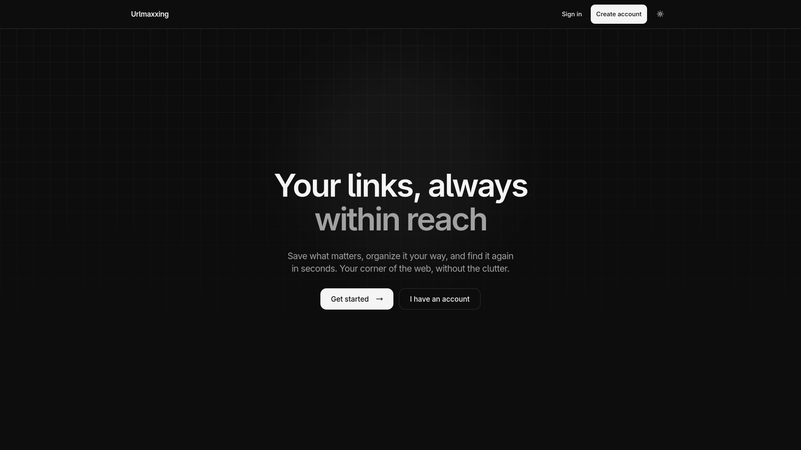

# Urlmaxxing

> [!NOTE]
> Urlmaxxing is still under development. This is a temporary README and will be expanded as the project evolves.

A full-stack application for saving, organizing, and quickly finding useful URLs.

## Current features

- Account registration and JWT-based authentication
- Private bookmark collections for each user
- Create, view, edit, and delete bookmarks
- Organize bookmarks with optional tags
- Search by title, URL, or tag
- Responsive interface with light and dark themes
- Loading, empty, success, and error feedback states

## Technologies

### Front end

React, TypeScript, Vite, Tailwind CSS, React Router, and Framer Motion.

### Back end

Rust, Axum, Tokio, SQLx, bcrypt, and PostgreSQL.

### Infrastructure and testing

Docker and Docker Compose support the API and database environment. Database changes are managed through SQL migrations, while Vitest, Testing Library, and Playwright cover front-end behavior and end-to-end flows.

## Implementation overview

The React front end communicates with a REST API built with Axum. Authentication uses JSON Web Tokens, passwords are stored as bcrypt hashes, and protected operations associate each bookmark with its authenticated owner. PostgreSQL provides persistent storage through SQLx.

## Planned improvements

- Rate limiting
- Stronger password rules
- More complete username rules and validation
- Additional security, usability, and documentation improvements

These items are planned and are not part of the current implementation yet.
